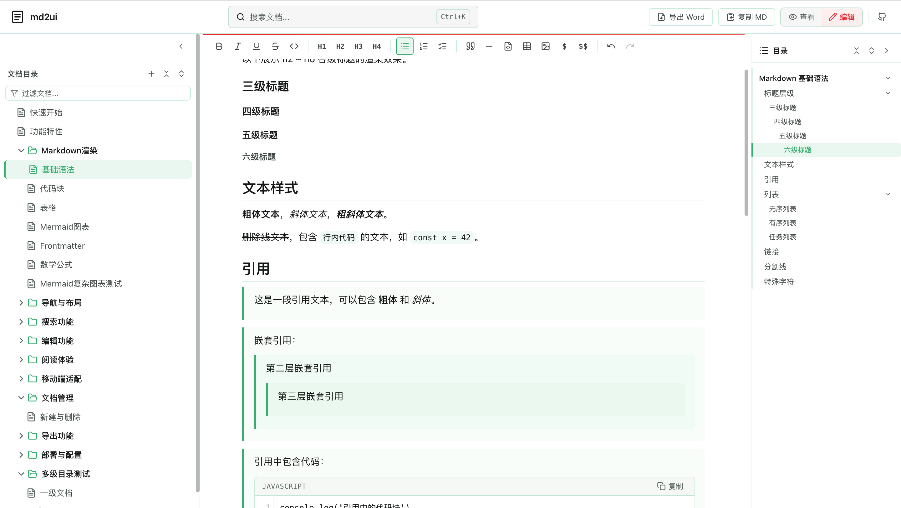
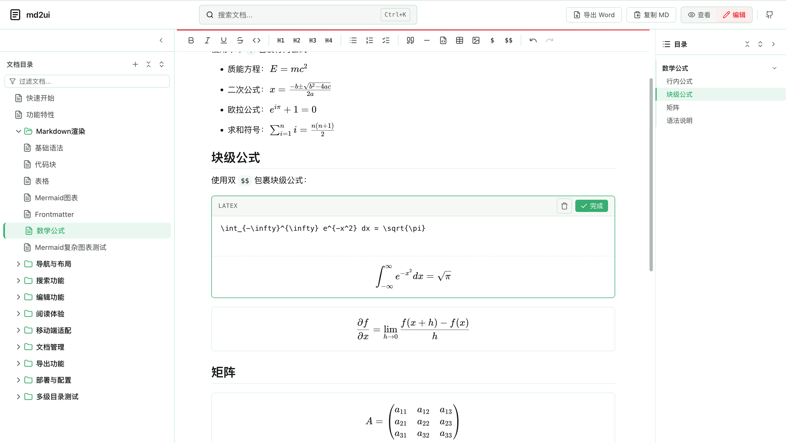
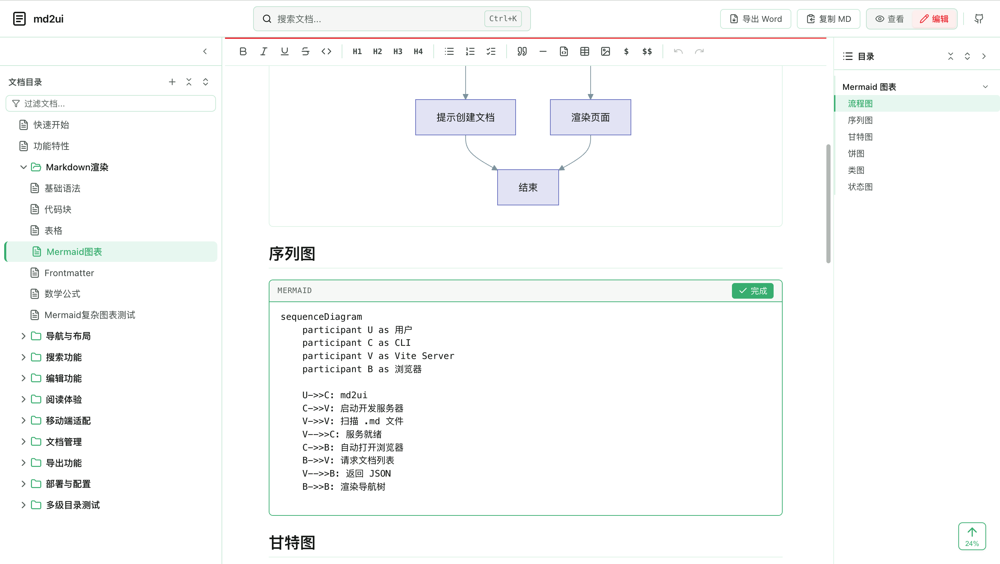

# mdpage

[](https://www.npmjs.com/package/mdpage)
[](https://github.com/ooaaaa/mdpage)
[](LICENSE)

一行命令，将本地 Markdown 文件转换为可预览、可编辑、可搜索的文档站点。

## 为什么需要 mdpage？

AI 编程时代，与 AI 协作会产生大量 Markdown 文档 —— 需求文档、设计方案、API 文档、技术调研……这些 `.md` 文件散落在项目各处：

- 文件越来越多，找一篇文档要翻半天
- IDE 的 Markdown 预览体验一般，表格、流程图、数学公式渲染不理想
- 想快速改几个字，还得切回编辑器找到对应文件
- 文档之间缺乏导航关系，无法形成知识体系

mdpage 把它指向你的文档目录，立刻获得一个功能完整的文档站点。

## 核心能力

| 能力 | 说明 |
|------|------|
| 零配置启动 | `cd docs && mdpage`，开箱即用 |
| 实时预览 | 文件变更自动刷新，所见即所得 |
| 在线编辑 | 内置富文本编辑器，浏览器中修改并保存到本地 |
| 全文搜索 | 基于 MiniSearch，毫秒级检索 |
| 自动导航 | 扫描目录结构生成多级目录树，支持拖拽排序 |
| 三栏布局 | 左侧导航 / 中间内容 / 右侧大纲，宽度可拖拽 |
| Markdown 增强 | GFM、代码高亮、Mermaid 图表、数学公式、Frontmatter |
| 移动端适配 | 响应式布局，手机端舒适阅读 |
| 阅读体验 | 进度条、预计阅读时间、上下篇导航、图片放大 |
| SSG 构建 | `mdpage build` 生成纯静态站点 |
| 自定义配置 | 站点标题、主题色、GitHub 链接、页脚等 |

## 界面预览

预览模式：




编辑模式：




## 快速开始

### 安装

```bash
npm install -g mdpage
```

或免安装直接运行：

```bash
npx mdpage
```

### 使用

在包含 `.md` 文件的目录下运行：

```bash
cd /path/to/your/docs
mdpage
```

访问 `http://localhost:3000` 查看文档。`-p` 指定端口：

```bash
mdpage -p 8080
```

### 静态构建

```bash
mdpage build
```

生成的静态文件在 `dist/` 目录下，可部署到 Nginx、GitHub Pages、Vercel 等任意静态托管服务。

## 文档组织

```
your-docs/
├── README.md              # 首页
├── 00-快速开始.md
├── 01-功能特性.md
└── 02-进阶指南/
    ├── 01-目录结构.md
    └── 02-自定义配置.md
```

- 使用 `序号-名称.md` 格式控制排序
- 文件夹同样支持序号前缀
- 支持任意层级嵌套

## 自定义配置

在文档目录下创建 `mdpage.config.js`：

```js
export default {
  title: '我的文档站',
  port: 8080,
  folderExpanded: true,
  themeColor: '#3eaf7c',
  github: 'https://github.com/your/repo',
  footer: 'Copyright © 2025'
}
```

| 配置项 | 类型 | 默认值 | 说明 |
|--------|------|--------|------|
| title | string | `'mdpage'` | 站点标题 |
| port | number | `3000` | 开发服务器端口 |
| folderExpanded | boolean | `false` | 文件夹默认展开 |
| themeColor | string | `'#3eaf7c'` | 主题色 |
| github | string | `''` | GitHub 仓库链接 |
| footer | string | `''` | 页脚内容 |

## 适用场景

- **AI 辅助开发** — 用 AI 生成的需求文档、设计方案统一管理，即时预览和编辑
- **个人知识库** — 日常笔记、学习记录丢进文件夹，自动组织成可浏览的站点
- **项目文档站** — API 文档、部署指南，`mdpage build` 一键构建静态站点
- **团队协作** — 配合 Git 管理文档版本，提交后自动构建部署

## 开发

```bash
git clone https://github.com/ooaaaa/mdpage.git
cd mdpage
pnpm install
pnpm dev
```

### 项目结构

```
mdpage/
├── bin/                   # CLI 入口
│   ├── mdpage.js           # dev server
│   └── build.js           # SSG 静态构建
├── src/
│   ├── App.vue            # 主组件
│   ├── components/        # Vue 组件
│   ├── composables/       # 组合式函数
│   ├── extensions/        # Tiptap 编辑器扩展
│   ├── services/          # 文档服务
│   └── style.css          # 全局样式
├── public/docs/           # 示例文档
└── vite.config.js         # Vite 配置
```

## 许可证

[MIT](LICENSE)
